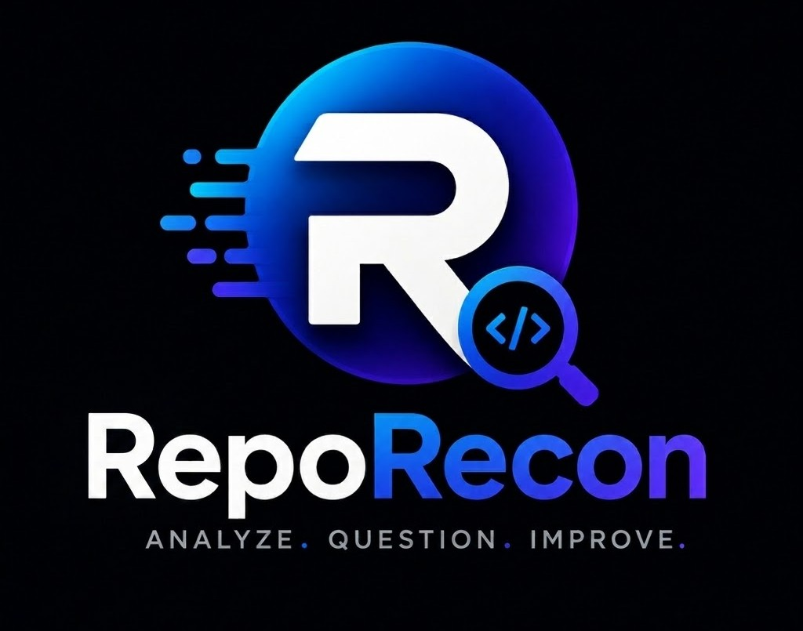

# RepoRecon

**Analyze. Question. Improve.** — a browser-based developer utility for public GitHub repositories.

Paste a repo URL and get an architecture summary, Mermaid diagram, health scores, issue notes, and a Q&A panel—powered by [Puter.js AI](https://docs.puter.com/AI/chat/) in the browser. No API keys, no local install.

**[Open RepoRecon on Puter →](https://puter.com/app/reporecon)**

[](LICENSE)

---

## Try it

Use the app from the [Puter App Center](https://puter.com/app/reporecon). Sign in with Puter if you want to save diagrams to your personal file space.

1. Open the link above.
2. Paste a public GitHub URL (for example `https://github.com/facebook/react`).
3. Run analysis, review the report, export PDF or a health badge, and ask follow-up questions in the chat panel.

You do not need to clone this repository or run a dev server to use RepoRecon.

---

## What you get

| Output | Description |
|--------|-------------|
| **Summary** | Plain-language overview of structure and patterns |
| **Diagram** | Mermaid architecture view (export or save to Puter FS) |
| **Health scores** | Security, performance, maintainability, documentation (0–100) |
| **Issues & fixes** | Detected risks and suggested next steps |
| **Q&A** | Ask where auth lives, what to fix first, and similar questions |

Analysis results stay in your browser (`localStorage`, up to 30 days) unless you choose **Save to Puter** for diagrams.

---

## How it works


The app reads public README and metadata from GitHub, sends a focused prompt through Puter’s AI layer, and renders the response in the UI. Everything runs client-side; there is no separate backend required for the hosted Puter build.

---

## Architecture at a glance


React + TypeScript front end, Puter.js for AI and optional file storage, Mermaid for diagrams, and local history for recent analyses.

---

## Overview deck

For a short walkthrough aimed at stakeholders and evaluators:

**[RepoRecon — product overview (Canva)](https://www.canva.com/design/DAG9Vr_WnHo/uZElXgVqcPm9d6SDqExkdg/view?utm_content=DAG9Vr_WnHo&utm_campaign=designshare&utm_medium=link2&utm_source=uniquelinks&utlId=hfb61c4573b)**

The deck covers the problem, workflow, and feature set in a presentation-friendly format.

---

## Feedback and issues

We welcome constructive reports and ideas.

- **In the app:** Help → Contact (opens your mail client with a pre-filled message).
- **On GitHub:** [open an issue](https://github.com/ASaha-os/RepoRecon/issues) with steps to reproduce, the repo URL you tried, and what you expected.

Please keep feedback specific and actionable—it helps us prioritize fixes.

---

## Repository layout

This repo is the open-source UI for RepoRecon. The `backend/` folder is legacy Django scaffolding from an earlier prototype; the Puter-hosted app does not depend on running it.

```
RepoRecon/
├── public/          # banner, workflow, blueprint assets
├── src/             # React app (views, Puter hooks, analysis UI)
├── backend/         # optional legacy API (not required for Puter)
└── README.md
```

---

## For developers (optional)

If you want to inspect or contribute to the front end:

```bash
git clone https://github.com/ASaha-os/RepoRecon.git
cd RepoRecon
npm install
npm run dev
```

Production use is intended through Puter, not self-hosting.

---

## License

MIT — see [LICENSE](LICENSE).

---

## Author

**Akash Saha** — [@ASaha-os](https://github.com/ASaha-os) · [LinkedIn](https://www.linkedin.com/in/akash-s-764359307/)

Built with [Puter](https://puter.com), React, and Mermaid.
