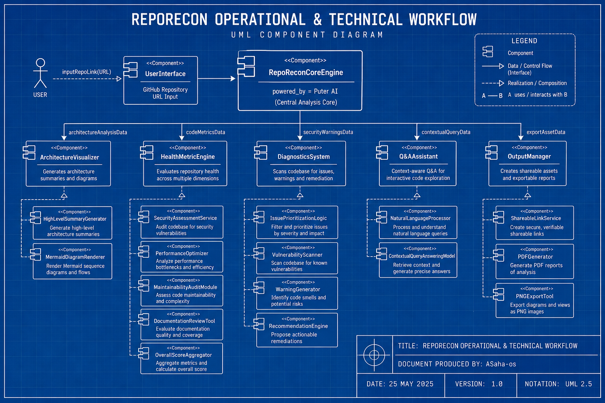

# RepoRecon

**Open-source developer utility for GitHub repository analysis.**

Paste a public repo URL. RepoRecon returns a readable architecture summary, health scores, diagrams, and suggested fixes. It runs in the browser and is powered by [Puter AI](https://puter.com) — no API keys to configure for end users.

---

## Try it (no local setup)

You do not need to clone or run this repo to use the product.

| Where | Link |
|-------|------|
| **Puter App Centre** (recommended) | [puter.com/app/reporecon](https://puter.com/app/reporecon) |
| **Web app** | [app-repo-recon.netlify.app](https://app-repo-recon.netlify.app/) |
| **Project site** | [repo-recon.vercel.app](https://repo-recon.vercel.app/) |

From the project site, use **Launch App** to open the full workspace in a new tab.

---

## What problem it solves

Teams onboarding to a new codebase, doing reviews, or planning refactors often spend hours reading folders and READMEs before they trust their mental model of the system. RepoRecon is built to shorten that loop: one URL in, structured output out.

Typical uses:

- Onboarding — get a map of the repo before the first PR  
- Reviews — spot architectural risks and doc gaps early  
- Planning — export a PDF or share a link with stakeholders  

Analysis is aimed at **public** GitHub repositories. Results are generated by AI and should be validated like any other assistant output.

---

## How it works


1. You submit a GitHub repository URL.  
2. Puter AI reads project context (structure, README, and related signals).  
3. You receive a dashboard: health score, sequence-style architecture view, issues, recommendations, and an optional Q&A panel for follow-up questions.  
4. You can share a link, download a scorecard image, or export a PDF report.

---

## What you get



| Output | Notes |
|--------|--------|
| **Health score** | Overall score plus security, performance, maintainability, and documentation breakdown |
| **Architecture diagram** | Mermaid-based flow derived from the repo |
| **Issues & recommendations** | Prioritized list of things worth fixing or discussing |
| **Codebase Q&A** | Ask where auth lives, how data flows, what to fix first |
| **Share & export** | Shareable analysis URLs, PNG scorecard, PDF report |

Free to use via Puter’s model — no sign-up wall on the analysis path itself.

---

## Powered by Puter

RepoRecon is a **Puter platform app**. Inference and the developer experience are built on Puter AI ([js.puter.com](https://js.puter.com/v2/)), which keeps the tool usable without asking every user to bring their own LLM API key.

Listing: **[Puter App Centre — RepoRecon](https://puter.com/app/reporecon)**

This repository holds the open-source UI (marketing site and app frontend). An optional Django backend under `backend/` exists for teams that want server-side Gemini analysis; that path is separate from the default Puter-powered flow.

---

## Feedback and issues

We welcome constructive input.

- **In the app** — use the contact / feedback option in the Puter or web UI when something breaks or a result looks wrong.  
- **On GitHub** — [open an issue](https://github.com/ASaha-os/RepoRecon/issues) with steps to reproduce, the repo URL you tried, and what you expected. Feature ideas are welcome too.

Please keep reports factual and respectful — it helps us respond faster.

---

## Repository contents (for contributors)

```
RepoRecon/
├── src/                 React + TypeScript (Vite)
│   ├── components/landing/
│   ├── lib/puterAI.ts   Puter integration
│   └── pages/
├── public/              Static assets (banner, workflow, blueprint)
├── backend/             Optional Django + Gemini API
└── LICENSE              MIT
```

If you are evaluating the product for a client demo, use the live links above rather than a local install.

---

## License

RepoRecon is released under the **MIT License**.

You may use, modify, and distribute the code with attribution. See [LICENSE](./LICENSE) for the full text.

```
Copyright (c) 2026 Akash Saha
```

---

## Maintainer

**Akash Saha**

- GitHub: [@ASaha-os](https://github.com/ASaha-os)  
- LinkedIn: [akash-s-764359307](https://www.linkedin.com/in/akash-s-764359307/)  
- Portfolio: [akashs-portfolio.vercel.app](https://akashs-portfolio.vercel.app/)

---

*RepoRecon — understand a codebase before you rewrite it.*
