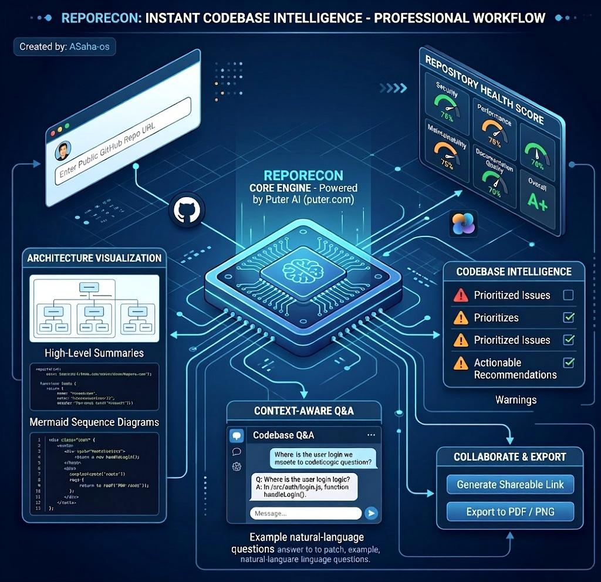
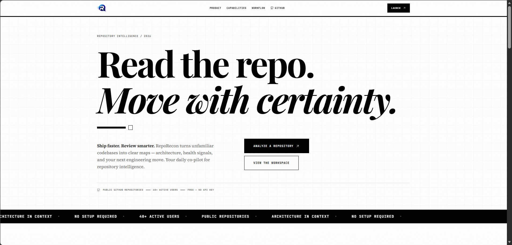
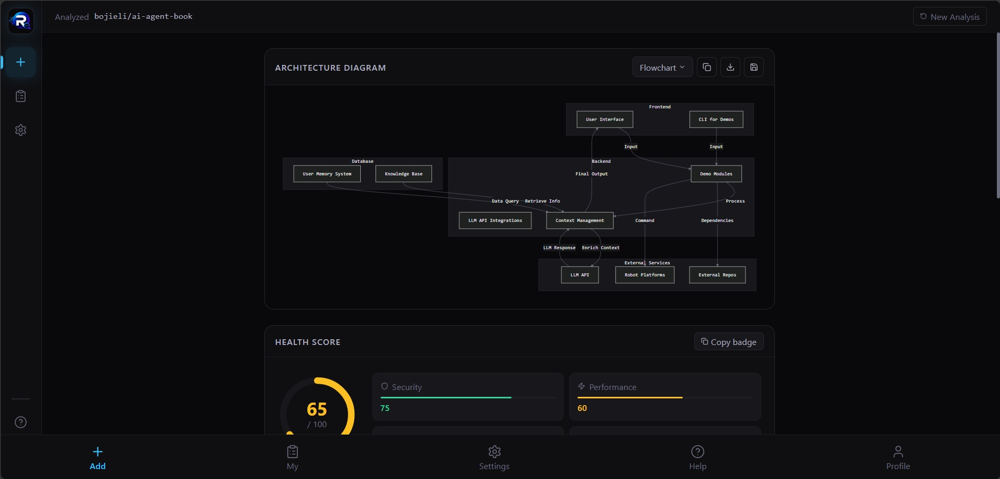
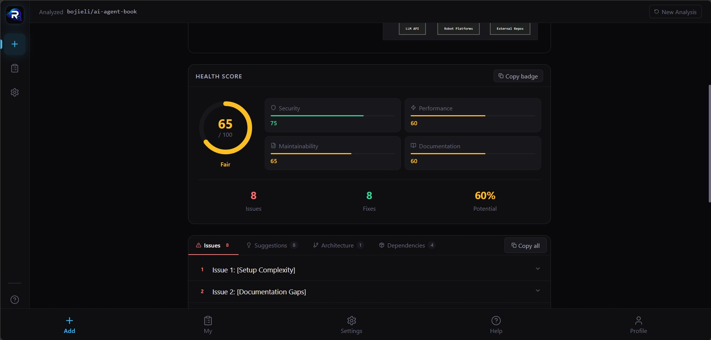
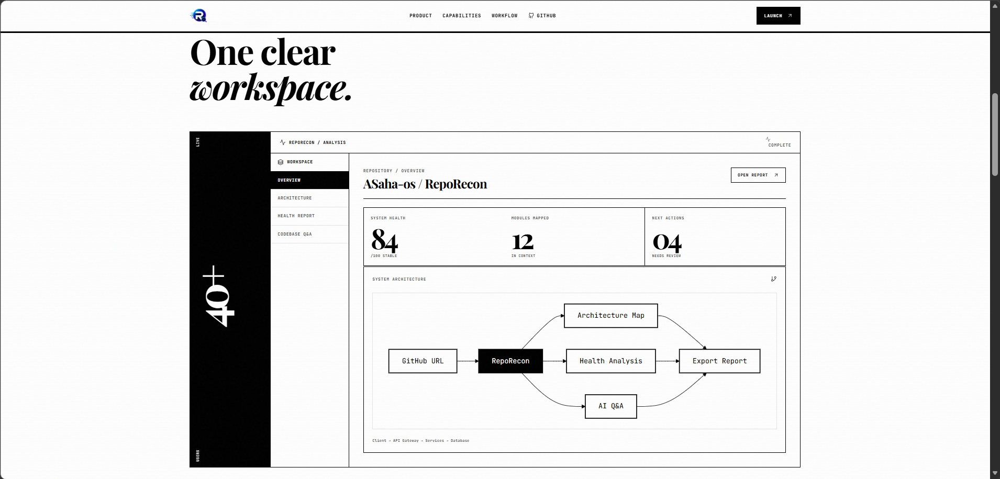
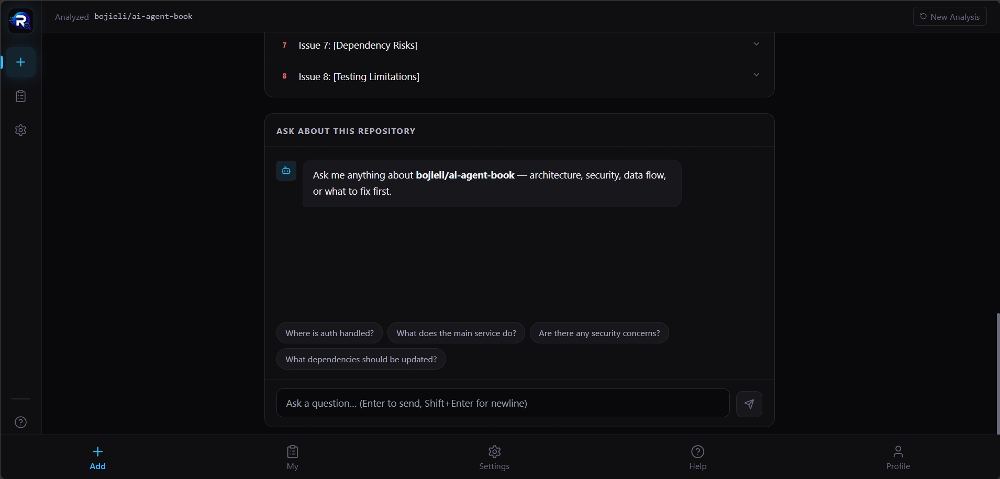
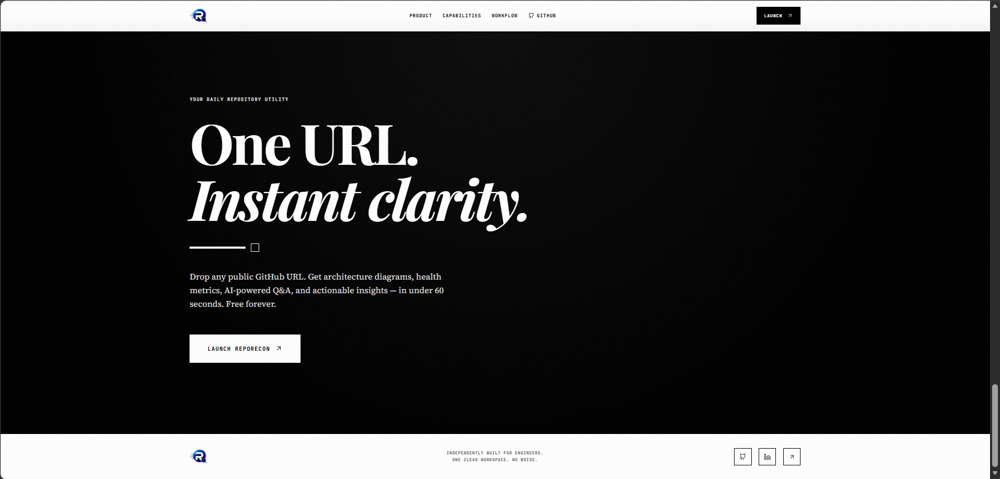

# RepoRecon

**Built for OpenAI Buildl Week 2026**

RepoRecon is an open-source utility for turning a public GitHub repository URL into a clear architectural brief, health snapshot, and action plan. The experience is designed for fast, conversational AI analysis — powered by **GPT-4o via Puter AI**, with a Codex-style, super-interactive feel for exploring a codebase.

Paste a repo URL and RepoRecon helps you quickly understand what the system does, where the risk is, and what is worth fixing first.

---

## 🌟 OpenAI Dedication

This project is dedicated to the **OpenAI Codex platform** and the transformative power of **GPT-4o**, **GPT-5.6 Luna**, and **ChatGPT Codex**. During the development process, these AI models didn't just assist — they acted as **senior developers**:

- **GPT-5.6 Luna**: Architected the entire frontend using React + TypeScript, designed the Minimalist Monochrome design system, built responsive Tailwind CSS layouts, and structured reusable component patterns
- **GPT-4o (via Puter AI)**: Powers the real-time repository analysis engine, generates Mermaid architecture diagrams, delivers intelligent Q&A responses, and provides actionable code insights
- **ChatGPT's Codex Assistant**: Connected frontend to backend APIs, debugged integration errors, reviewed code for production readiness, optimized performance, and ensured error-free deployment

### More Than an AI Model — A Senior Developer

Traditional AI tools generate code snippets. GPT went further:
- ✅ **Zero-error deployments** — production-ready code on first iteration
- ✅ **Architectural decisions** — recommended design patterns, component structures, state management
- ✅ **Real-time debugging** — identified edge cases, fixed TypeScript errors, optimized bundle sizes
- ✅ **Best practices** — enforced accessibility standards, responsive design, clean code principles

**Result**: A fully functional, deployment-ready application built in record time with enterprise-grade code quality.

> *"GPT didn't write code. It architected, debugged, optimized, and shipped — exactly like a senior dev on the team."*  
> — Built during OpenAI Buildl Week 2026

### Models Powering RepoRecon

| Model | Role | Use Case |
|-------|------|----------|
| **GPT-4o** | Repository Intelligence | Real-time codebase analysis, architecture mapping, security audits, Q&A engine |
| **GPT-5.6 Luna** | Frontend Development | React component design, TypeScript architecture, UI/UX implementation |
| **ChatGPT Codex** | Development Assistant | Backend integration, error debugging, code review, deployment optimization |

---

## Try it live

No local setup is required to explore the product.

| Where | Link |
|---|---|
| Puter App Centre | [puter.com/app/reporecon](https://puter.com/app/reporecon) |
| Web app | [app-repo-recon.netlify.app](https://app-repo-recon.netlify.app/) |
| Project site | [repo-recon.vercel.app](https://repo-recon.vercel.app/) |

From the project site, use Launch App to open the full workspace in a new tab.

---

## What problem it solves

Teams onboarding to a new codebase, reviewing a pull request, or planning a refactor often spend too much time reading folders and README files before they can trust their mental model of the system. RepoRecon shortens that loop by turning repository context into structured, readable outputs.

Typical use cases include:

- Onboarding a new engineer into an unfamiliar codebase
- Reviewing architecture and spotting risk early
- Planning migrations, refactors, or technical debt work
- Sharing a quick stakeholder-friendly summary

Analysis is aimed at public GitHub repositories. Results are AI-generated and should still be validated like any other assistant output.

---

## How it works



1. Submit a GitHub repository URL.
2. RepoRecon gathers repository context, structure, and documentation signals.
3. The app generates a dashboard with a health score, architecture view, issues, recommendations, and follow-up Q&A.
4. You can share the analysis, export a scorecard image, or generate a PDF-style report.

---

## What you get

| Output | Notes |
|---|---|
| Health score | Overall score plus security, performance, maintainability, and documentation breakdown |
| Architecture view | Mermaid-based flow derived from the repository |
| Issues and recommendations | Prioritized findings that are worth fixing or discussing |
| Codebase Q&A | Ask where auth lives, how data flows, or what to fix first |
| Share and export | Shareable analysis URLs, scorecard PNG, and PDF report |

The default experience is powered by Puter AI and does not require end users to bring their own API key.

---

## App screenshots

A quick collage of the current experience:

<div align="center">
  <table>
    <tr>
      <td valign="top"></td>
      <td valign="top"></td>
      <td valign="top"></td>
    </tr>
    <tr>
      <td valign="top"></td>
      <td valign="top"></td>
      <td valign="top"></td>
    </tr>
  </table>
</div>

---

## Tech stack

- **AI Engine**: GPT-4o via Puter AI (no API key required)
- **Development**: GPT-5.6 Luna + ChatGPT's Codex (frontend architecture, debugging, integration)
- Frontend: React, TypeScript, Vite
- Styling: Tailwind CSS (Minimalist Monochrome design system), shadcn/ui
- Motion and visuals: Framer Motion, Mermaid, Recharts
- Export tools: html2canvas and jsPDF
- Optional backend: Django + Gemini for teams that want a server-side analysis path

---

## Local development

If you want to run the UI locally:

```bash
npm install
npm run dev
```

For the optional backend:

```bash
cd backend
pip install -r requirements.txt
python manage.py runserver
```

---

## Feedback and issues

We welcome constructive input.

- In the app: use the feedback option in the Puter or web UI when something breaks or a result looks wrong.
- On GitHub: [open an issue](https://github.com/ASaha-os/RepoRecon/issues) with steps to reproduce, the repo URL you tried, and what you expected.

Please keep reports factual and respectful so they are easier to act on.

---

## Repository layout

```text
RepoRecon/
├── src/                  React + TypeScript (Vite)
│   ├── components/       Landing page and UI blocks
│   ├── lib/              Puter and helper integrations
│   └── pages/            App entry points
├── public/               Static assets and marketing visuals
├── backend/              Optional Django + Gemini backend
└── LICENSE               MIT
```

---

## License

RepoRecon is released under the MIT License.

You may use, modify, and distribute the code with attribution. See [LICENSE](./LICENSE) for the full text.

```text
Copyright (c) 2026 Akash Saha
```

---

## Maintainer

Akash Saha

- GitHub: [@ASaha-os](https://github.com/ASaha-os)
- LinkedIn: [akash-s-764359307](https://www.linkedin.com/in/akash-s-764359307/)
- Portfolio: [akashs-portfolio.vercel.app](https://akashs-portfolio.vercel.app/)

---

RepoRecon — understand a codebase before you rewrite it.
